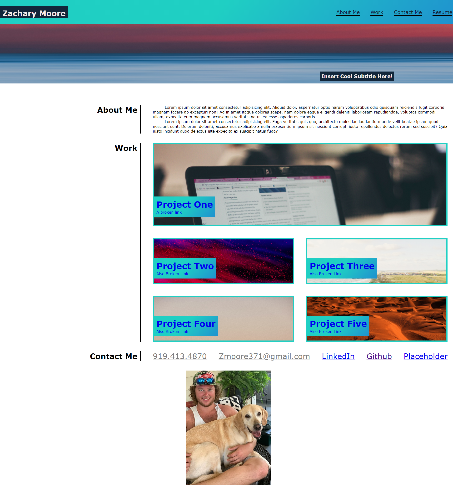

# Landing Page for Myself

The goal of this project was to create and style a website using CSS to create a landing page to showcase my projects, contact information, resume, and also include a picture of myself. 

## Usage

The navigation bar at the top of the page will jump you to the relevant section and also has a placeholder that will link a resume. The cards inside the main body of the HTML will glow when the mouse is hovered over them. At the bottom of the page is relevant contact information and links to various social media. 

 

## Link to Live Webpage

Using the following link you cna navigate to my live webpage. [https://zmoore371.github.io/Homework-Week-2/] (Landing Page of Zachary Moore)